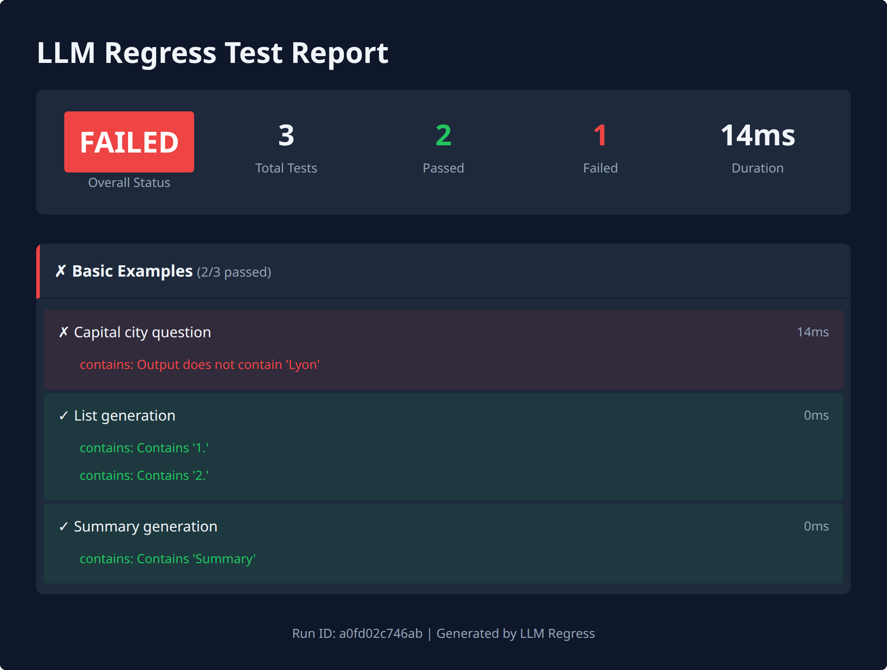
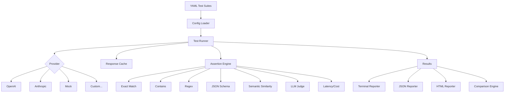

# LLM Regress

[](https://github.com/SmitHunter/llm-regress/actions/workflows/ci.yaml)
[](https://www.python.org/downloads/)
[](https://opensource.org/licenses/MIT)

**Regression testing for LLM prompts and models, designed for CI pipelines.**

YAML suites, assertions (contains, regex, JSON schema, LLM-as-judge, latency/cost), and `llm-regress compare` to fail CI when a prompt or model change regresses a previously passing test.


Recorded from a real mock-provider run of a copy of `examples/basic.yaml`. Tape: [`docs/hero.tape`](docs/hero.tape). Re-record with `./docs/record-hero.sh`.



HTML report from `llm-regress run suite.yaml -o report.html` on the same failing mock run (`FAILED`, 3 tests, 2 passed, 1 failed, 14ms, run ID `a0fd02c746ab`). The file includes overall status, counts, duration, per-suite tests, assertion messages, and the run ID. Source: [`docs/html-report.html`](docs/html-report.html). Re-capture with `./docs/record-report.sh`.

**All published terminal output, the hero GIF, and the HTML report come from the mock provider.** A real-model case study (two models or two prompt versions, with latency and cost) needs an API key and is not in this repo yet.

This repo runs its own prompt regression workflow in CI: [Prompt Regression Tests](https://github.com/SmitHunter/llm-regress/actions/workflows/llm-regress-action.yaml) ([workflow file](.github/workflows/llm-regress-action.yaml)). On push to `main` it saves a baseline artifact from `examples/`; on pull requests it compares the current run against that baseline, comments on the PR, and fails if regressions are found.

## Example Output

Captured from `llm-regress run examples/basic.yaml` using the mock provider (exit 0):

```
─────────────────────────── LLM Regress Test Results ───────────────────────────

✓ Basic Examples (3/3 passed, 14ms)
  ✓ Capital city question [13ms]
  ✓ List generation [0ms]
  ✓ Summary generation [0ms]

╭─────────────────────────────────── PASSED ───────────────────────────────────╮
│   Total Tests    3                                                           │
│   Passed         3                                                           │
│   Failed         0                                                           │
│   Duration       14ms                                                        │
│   Run ID         1307b643adf5                                                │
╰──────────────────────────────────────────────────────────────────────────────╯
```

`llm-regress run examples/` (all five bundled suites, mock provider) was 13/13 passed in 47ms (run ID `34f40d131cdd`).

## Comparing Runs

```bash
llm-regress run suite.yaml --save-run baseline.json
# change an assertion or prompt
llm-regress run suite.yaml --save-run current.json
llm-regress compare baseline.json current.json
```

Captured after changing `examples/basic.yaml`'s capital-city assertion from `Paris` to `Lyon` (mock still returns `Paris`). `llm-regress compare` printed the following and exited 1:

```
──────────────────────────────── Run Comparison ────────────────────────────────

Baseline: 1307b643adf5
Current:  26648aaec851

Basic Examples
  ↓ Capital city question [regressed]

╭──────────────────────────── REGRESSIONS DETECTED ────────────────────────────╮
│  Regressions   1                                                             │
│  Improvements  0                                                             │
╰──────────────────────────────────────────────────────────────────────────────╯
```

The failing run itself (exit 1) was 2/3 passed, 14ms, run ID `26648aaec851`, with `contains: Output does not contain 'Lyon'`.

## Quick Start

The package is not on PyPI yet. Install from this repository:

```bash
git clone https://github.com/SmitHunter/llm-regress.git
cd llm-regress
pip install -e .

# Optional extras
pip install -e ".[openai]"      # OpenAI provider
pip install -e ".[anthropic]"   # Anthropic provider
pip install -e ".[all]"         # OpenAI, Anthropic, and semantic similarity
```

From another project:

```bash
pip install "llm-regress @ git+https://github.com/SmitHunter/llm-regress.git"
```

```bash
llm-regress init                 # writes tests/prompts/example.yaml
llm-regress run tests/prompts/   # mock provider, no API key
llm-regress run examples/        # bundled suites in this repo
llm-regress run tests/prompts/ --save-run baseline.json
```

`llm-regress init` creates `tests/prompts/example.yaml` (mock provider, contains / JSON schema / latency assertions). Override the suite provider with `--provider openai` or `--provider anthropic` when you have the extra and an API key.

## Test Suite Format

```yaml
name: My Test Suite
description: Optional description
provider:
  name: openai
  model: gpt-6-luna
  # api_key from OPENAI_API_KEY env var

defaults:
  language: Python  # Available in all prompts as {{ language }}

tests:
  - name: Descriptive test name
    description: Optional test description
    prompt: |
      Write a {{ language }} function that {{ task }}.
      Be concise.
    inputs:
      task: calculates factorial
    assertions:
      - type: contains
        value: "def"
      - type: regex
        value: "factorial|fact"
      - type: latency_budget
        budget_ms: 2000
    tags:
      - code-generation
      - math
```

## Assertion Types

| Type | Description | Configuration |
|------|-------------|---------------|
| `exact` | Exact string match | `value: "expected text"` |
| `contains` | Substring match (case-insensitive) | `value: "substring"` |
| `regex` | Regular expression match | `value: "pattern.*"` |
| `json_schema` | Valid JSON matching schema | `schema: {type: object, ...}` |
| `semantic_similarity` | Embedding-based similarity | `value: "reference text"`, `threshold: 0.8` |
| `llm_judge` | LLM evaluates against rubric | `rubric: "Criteria for evaluation"` |
| `latency_budget` | Response time limit | `budget_ms: 1000` |
| `cost_budget` | Cost limit per request | `budget_dollars: 0.01` |

See `examples/` for suites covering contains, JSON schema, LLM-as-judge, latency/cost budgets, and template variables.

## CLI Reference

```bash
llm-regress run <paths>           # Run test suites
llm-regress run tests/ -v         # Verbose output
llm-regress run tests/ -o out.json    # JSON output
llm-regress run tests/ -o report.html # HTML report
llm-regress run tests/ --save-run run.json  # Save for comparison
llm-regress run tests/ -j 10      # 10 concurrent tests
llm-regress run tests/ -x         # Stop on first failure
llm-regress run tests/ -t smoke   # Only tests tagged "smoke"
llm-regress run tests/ --provider mock
llm-regress run tests/ -f json    # JSON on stdout (exit 0/1 still applies)

llm-regress compare baseline.json current.json
llm-regress compare baseline.json current.json -o diff.json

llm-regress validate tests/       # Validate YAML files
llm-regress list tests/           # List all tests
llm-regress init                  # Create example suite

llmr run tests/                   # Shorthand alias
```

## GitHub Actions

This repository already runs the workflow above. To copy it into another repo, see [`.github/workflows/llm-regress-action.yaml`](.github/workflows/llm-regress-action.yaml): cache, baseline artifact on `main`, compare on PRs, PR comment, HTML report artifact, fail on regressions.

Minimal run-only job:

```yaml
# .github/workflows/prompt-tests.yaml
name: Prompt Tests

on: [push, pull_request]

jobs:
  test:
    runs-on: ubuntu-latest
    steps:
      - uses: actions/checkout@v4
      - uses: actions/setup-python@v5
        with:
          python-version: "3.12"
      - name: Install llm-regress
        run: pip install "llm-regress @ git+https://github.com/SmitHunter/llm-regress.git"
      - name: Run prompt tests
        run: llm-regress run tests/prompts/
```

The `CI` workflow in this repo also runs `llm-regress run examples/` from the PR checkout (mock provider).

## Architecture



| Module | Description |
|--------|-------------|
| `llm_regress.config` | YAML parsing and test suite configuration |
| `llm_regress.providers` | LLM provider implementations (OpenAI, Anthropic, Mock) |
| `llm_regress.assertions` | Assertion types and validation logic |
| `llm_regress.runner` | Concurrent test execution and caching |
| `llm_regress.compare` | Run comparison and regression detection |
| `llm_regress.reporters` | Terminal, JSON, and HTML output |
| `llm_regress.cli` | Command-line interface |

## Extending

```python
from llm_regress.assertions import Assertion, AssertionResult, AssertionRegistry

class ToxicityAssertion(Assertion):
    name = "toxicity"

    def evaluate(self, response, config) -> AssertionResult:
        is_safe = check_toxicity(response.content)
        return AssertionResult(
            passed=is_safe,
            assertion_type=self.name,
            message="Content is safe" if is_safe else "Toxic content detected",
        )

AssertionRegistry.register("toxicity", ToxicityAssertion)
```

Providers use the same registry pattern (`ProviderRegistry.register`). Details: [docs/custom-assertions.md](docs/custom-assertions.md), [docs/custom-providers.md](docs/custom-providers.md).

## Configuration

| Variable | Description |
|----------|-------------|
| `OPENAI_API_KEY` | OpenAI API key |
| `ANTHROPIC_API_KEY` | Anthropic API key |
| `LLM_REGRESS_CACHE_DIR` | Response cache directory |

```yaml
provider:
  name: openai
  model: gpt-6-luna
  api_key: ${OPENAI_API_KEY}  # From environment
  base_url: https://custom-endpoint.com/v1  # Optional
  options:
    temperature: 0.7
    max_tokens: 1000
```

If `model` is omitted, OpenAI uses `gpt-6-luna` and Anthropic uses `claude-haiku-4-5` (the current inexpensive generally available models as of 2026-10-06). Cost estimates use published short-context list prices and are approximate.

## Design Decisions

- **YAML-first configuration**: Test suites are defined in YAML rather than code because prompts are closer to data than logic. YAML fits version control and code review.

- **Deterministic mock provider**: The mock provider generates responses from prompt content patterns (for example, a France capital question returns `Paris`). That keeps the examples and CI offline. It is not a substitute for a real model.

- **Environment interpolation**: Suite YAML may use `${VAR}` and `${VAR:-default}`. A sole `${VAR}` that is unset becomes `null`, so `api_key: ${OPENAI_API_KEY}` falls back to the provider's own environment lookup instead of sending the literal placeholder.

- **Async-first execution**: All provider calls use async/await with configurable concurrency limits.

- **Pluggable architecture**: Providers and assertions use a registry pattern.

- **Semantic caching**: Response cache keys include the full prompt, model, and relevant parameters.

## Limitations

- **No streaming response testing**: Currently only supports request/response patterns.

- **Semantic similarity requires extra dependencies**: The `sentence-transformers` library adds ~500MB of dependencies. It's optional but needed for embedding-based assertions.

- **LLM-as-judge reliability**: `llm_judge` calls the suite's provider with a rubric prompt. With a real provider, verdicts can vary between runs. With the mock provider, the judge PASSes when the evaluated output is non-empty — it does not score rubric quality.

- **Not on PyPI yet**: Install from GitHub or a local clone until a release is published.

- **Cost estimation is approximate**: Token counts and costs are estimated from published list prices. Billed cost can differ by tier, caching, and long-context pricing.

- **Single-turn conversations only**: Each test runs a single prompt. Multi-turn conversations and chat history are not currently supported.

## Roadmap

Not started: streaming assertions, multi-turn tests, parametrized cases, and additional providers. No dates attached.

## Contributing

Install with `pip install -e ".[dev]"` and run the same checks as CI: `ruff check src tests`, `ruff format --check src tests`, `mypy src`, `pytest`. Open a pull request against `main`.

## License

MIT License — see [LICENSE](LICENSE) for details.

---

Built by **Hunter Smith**, AI Engineer, Melbourne · [GitHub](https://github.com/SmitHunter) · [LinkedIn](https://www.linkedin.com/in/hunter-sm/)
