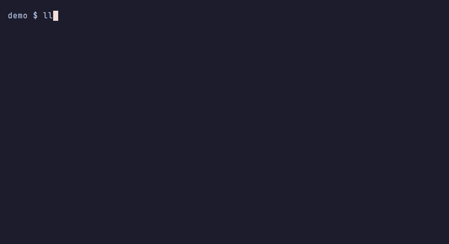
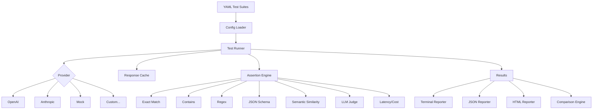

# LLM Regress

[](https://github.com/SmitHunter/llm-regress/actions/workflows/ci.yaml)
[](https://www.python.org/downloads/)
[](https://opensource.org/licenses/MIT)
[](https://github.com/astral-sh/ruff)

**Regression testing for LLM prompts and models, designed for CI pipelines.**



Recorded from a real mock-provider run of a copy of `examples/basic.yaml`. Tape: [`docs/hero.tape`](docs/hero.tape). Re-record with `./docs/record-hero.sh`.

LLM Regress helps teams catch prompt regressions before they reach production. Define test suites in YAML, run them locally or in CI, and get clear reports on what changed between model versions, prompt iterations, or configuration changes.

## Why LLM Regress?

Prompt engineering is iterative, but without proper testing:
- A "small tweak" to a prompt can break downstream features
- Upgrading models (GPT-5 → GPT-6, Claude Sonnet 4 → Claude Sonnet 5.5) may change behavior
- Cost optimizations can silently degrade quality
- There's no clear history of what worked and what didn't

LLM Regress brings software testing practices to LLM development:

```yaml
# tests/prompts/customer-support.yaml
name: Customer Support Bot Tests
provider: openai

tests:
  - name: Greeting includes name
    prompt: "Greet the customer: {{ name }}"
    inputs:
      name: Alice
    assertions:
      - type: contains
        value: Alice
      - type: llm_judge
        rubric: Response is friendly and professional
```

## Features

- **YAML test definitions** — version-controlled, human-readable test suites
- **Multiple assertion types** — exact match, contains, regex, JSON schema, semantic similarity, LLM-as-judge, latency/cost budgets
- **Pluggable providers** — OpenAI, Anthropic, or mock provider for offline testing
- **Concurrent execution** — run tests in parallel with configurable concurrency
- **Response caching** — avoid redundant API calls during development
- **Run comparison** — compare model A vs B, prompt v1 vs v2, detect regressions
- **CI-friendly** — exit codes, JSON output, GitHub Actions integration
- **Beautiful reports** — rich terminal output and HTML reports

## Quick Start

### Installation

The package is not on PyPI yet. Install from this repository:

```bash
git clone https://github.com/SmitHunter/llm-regress.git
cd llm-regress
pip install -e .

# Optional extras
pip install -e ".[openai]"      # OpenAI provider
pip install -e ".[anthropic]"   # Anthropic provider
pip install -e ".[all]"         # OpenAI, Anthropic, and semantic similarity
```

From another project, once this repo is public:

```bash
pip install "llm-regress @ git+https://github.com/SmitHunter/llm-regress.git"
```

### Create Your First Test

```bash
llm-regress init
```

This creates `tests/prompts/example.yaml`:

```yaml
name: Example Test Suite
description: Sample tests demonstrating llm-regress features
provider: mock

tests:
  - name: Capital of France
    prompt: What is the capital of France?
    assertions:
      - type: contains
        value: Paris

  - name: JSON Response
    prompt: Return a JSON object with a "status" field set to "success"
    assertions:
      - type: json_schema
        schema:
          type: object
          required: [status]
          properties:
            status:
              type: string
              enum: [success, error]

  - name: Code Generation
    prompt: Write a Python function that returns 42
    assertions:
      - type: contains
        value: "def"
      - type: contains
        value: "42"
      - type: latency_budget
        budget_ms: 1000
```

### Run Tests

```bash
# Run with the mock provider (no API key needed)
llm-regress run tests/prompts/

# Run the bundled examples from this repo
llm-regress run examples/

# Override the suite provider (requires the matching extra + API key)
export OPENAI_API_KEY=sk-...
llm-regress run tests/prompts/ --provider openai

# Save results for later comparison
llm-regress run tests/prompts/ --save-run baseline.json
```

### Example Output

Captured from `llm-regress run examples/basic.yaml` using the mock provider:

```
─────────────────────────── LLM Regress Test Results ───────────────────────────

✓ Basic Examples (3/3 passed, 15ms)
  ✓ Capital city question [15ms]
  ✓ List generation [0ms]
  ✓ Summary generation [0ms]

╭─────────────────────────────────── PASSED ───────────────────────────────────╮
│   Total Tests    3                                                           │
│   Passed         3                                                           │
│   Failed         0                                                           │
│   Duration       15ms                                                        │
│   Run ID         a27d142a1b4c                                                │
╰──────────────────────────────────────────────────────────────────────────────╯
```

## Test Suite Format

```yaml
name: My Test Suite
description: Optional description
provider:
  name: openai
  model: gpt-6-luna
  # api_key from OPENAI_API_KEY env var

defaults:
  language: Python  # Available in all prompts as {{ language }}

tests:
  - name: Descriptive test name
    description: Optional test description
    prompt: |
      Write a {{ language }} function that {{ task }}.
      Be concise.
    inputs:
      task: calculates factorial
    assertions:
      - type: contains
        value: "def"
      - type: regex
        value: "factorial|fact"
      - type: latency_budget
        budget_ms: 2000
    tags:
      - code-generation
      - math
```

## Assertion Types

| Type | Description | Configuration |
|------|-------------|---------------|
| `exact` | Exact string match | `value: "expected text"` |
| `contains` | Substring match (case-insensitive) | `value: "substring"` |
| `regex` | Regular expression match | `value: "pattern.*"` |
| `json_schema` | Valid JSON matching schema | `schema: {type: object, ...}` |
| `semantic_similarity` | Embedding-based similarity | `value: "reference text"`, `threshold: 0.8` |
| `llm_judge` | LLM evaluates against rubric | `rubric: "Criteria for evaluation"` |
| `latency_budget` | Response time limit | `budget_ms: 1000` |
| `cost_budget` | Cost limit per request | `budget_dollars: 0.01` |

### Assertion Examples

```yaml
tests:
  # Exact match
  - name: Exact greeting
    prompt: Say exactly "Hello, World!"
    assertions:
      - type: exact
        value: "Hello, World!"

  # Contains (case-insensitive)
  - name: Mentions Python
    prompt: What language is Django written in?
    assertions:
      - type: contains
        value: python

  # Regex pattern
  - name: Returns a number
    prompt: What is 15 * 7?
    assertions:
      - type: regex
        value: "\\b105\\b"

  # JSON Schema validation
  - name: Structured output
    prompt: Return user data as JSON
    assertions:
      - type: json_schema
        schema:
          type: object
          required: [name, email]
          properties:
            name: {type: string}
            email: {type: string, format: email}

  # Semantic similarity (requires sentence-transformers)
  - name: Similar meaning
    prompt: Explain what an API is
    assertions:
      - type: semantic_similarity
        value: "An API is an interface for software communication"
        threshold: 0.7

  # LLM as judge
  - name: Helpful response
    prompt: How do I learn programming?
    assertions:
      - type: llm_judge
        rubric: |
          The response should:
          1. Suggest specific resources or steps
          2. Be encouraging and supportive
          3. Be appropriate for beginners

  # Performance budgets
  - name: Fast response
    prompt: Quick question
    assertions:
      - type: latency_budget
        budget_ms: 500
      - type: cost_budget
        budget_dollars: 0.001
```

## Comparing Runs

Detect regressions when changing prompts, models, or configurations:

```bash
# Create baseline from main branch
llm-regress run tests/ --save-run baseline.json

# Make changes, create new run
llm-regress run tests/ --save-run current.json

# Compare runs
llm-regress compare baseline.json current.json
```

Output from comparing a passing run against a later run of the same test with a failing assertion:

```
──────────────────────────────── Run Comparison ────────────────────────────────

Baseline: 2045941b531d
Current:  fbc03db15e1a

Geography checks
  ↓ Capital of France [regressed]

╭──────────────────────────── REGRESSIONS DETECTED ────────────────────────────╮
│  Regressions   1                                                             │
│  Improvements  0                                                             │
╰──────────────────────────────────────────────────────────────────────────────╯
```

## CLI Reference

```bash
# Run tests
llm-regress run <paths>           # Run test suites
llm-regress run tests/ -v         # Verbose output
llm-regress run tests/ -o out.json    # JSON output
llm-regress run tests/ -o report.html # HTML report
llm-regress run tests/ --save-run run.json  # Save for comparison
llm-regress run tests/ -j 10      # 10 concurrent tests
llm-regress run tests/ -x         # Stop on first failure
llm-regress run tests/ -t smoke   # Only tests tagged "smoke"
llm-regress run tests/ --provider mock
llm-regress run tests/ -f json    # JSON on stdout (exit 0/1 still applies)

# Compare runs
llm-regress compare baseline.json current.json
llm-regress compare baseline.json current.json -o diff.json

# Other commands
llm-regress validate tests/       # Validate YAML files
llm-regress list tests/           # List all tests
llm-regress init                  # Create example suite

# Shorthand alias
llmr run tests/
```

## GitHub Actions Integration

### Basic CI Setup

```yaml
# .github/workflows/prompt-tests.yaml
name: Prompt Tests

on: [push, pull_request]

jobs:
  test:
    runs-on: ubuntu-latest
    steps:
      - uses: actions/checkout@v4
      - uses: actions/setup-python@v5
        with:
          python-version: "3.12"
      
      - name: Install llm-regress
        run: pip install "llm-regress @ git+https://github.com/SmitHunter/llm-regress.git"
      
      - name: Run prompt tests
        run: llm-regress run tests/prompts/
```

### Advanced: Regression Detection

See [`.github/workflows/llm-regress-action.yaml`](.github/workflows/llm-regress-action.yaml) for a complete example with:
- Caching to avoid redundant API calls
- Baseline comparison on PRs
- Automatic PR comments with results
- Artifact uploads for HTML reports

## Architecture



### Module Overview

| Module | Description |
|--------|-------------|
| `llm_regress.config` | YAML parsing and test suite configuration |
| `llm_regress.providers` | LLM provider implementations (OpenAI, Anthropic, Mock) |
| `llm_regress.assertions` | Assertion types and validation logic |
| `llm_regress.runner` | Concurrent test execution and caching |
| `llm_regress.compare` | Run comparison and regression detection |
| `llm_regress.reporters` | Terminal, JSON, and HTML output |
| `llm_regress.cli` | Command-line interface |

## Extending LLM Regress

### Custom Assertions

```python
from llm_regress.assertions import Assertion, AssertionResult, AssertionRegistry

class ToxicityAssertion(Assertion):
    name = "toxicity"
    
    def evaluate(self, response, config) -> AssertionResult:
        # Your toxicity detection logic
        is_safe = check_toxicity(response.content)
        return AssertionResult(
            passed=is_safe,
            assertion_type=self.name,
            message="Content is safe" if is_safe else "Toxic content detected",
        )

AssertionRegistry.register("toxicity", ToxicityAssertion)
```

See [docs/custom-assertions.md](docs/custom-assertions.md) for details.

### Custom Providers

```python
from llm_regress.providers import Provider, ProviderResponse, ProviderRegistry

class OllamaProvider(Provider):
    name = "ollama"
    
    async def complete(self, prompt, model=None, **kwargs) -> ProviderResponse:
        # Your Ollama API logic
        ...

ProviderRegistry.register("ollama", OllamaProvider)
```

See [docs/custom-providers.md](docs/custom-providers.md) for details.

## Configuration

### Environment Variables

| Variable | Description |
|----------|-------------|
| `OPENAI_API_KEY` | OpenAI API key |
| `ANTHROPIC_API_KEY` | Anthropic API key |
| `LLM_REGRESS_CACHE_DIR` | Response cache directory |

### Provider Configuration

```yaml
provider:
  name: openai
  model: gpt-6-luna
  api_key: ${OPENAI_API_KEY}  # From environment
  base_url: https://custom-endpoint.com/v1  # Optional
  options:
    temperature: 0.7
    max_tokens: 1000
```

If `model` is omitted, OpenAI uses `gpt-6-luna` and Anthropic uses `claude-haiku-4-5` (the current inexpensive generally available models as of 2026-10-06). Cost estimates use published short-context list prices and are approximate.

## Design Decisions

- **YAML-first configuration**: Test suites are defined in YAML rather than code because prompts are closer to data than logic. YAML integrates naturally with version control, code review, and non-engineering stakeholders who may write or review prompts.

- **Deterministic mock provider**: The mock provider generates responses from prompt content patterns (for example, a France capital question returns `Paris`). That keeps the examples and CI offline. It is not a substitute for a real model.

- **Environment interpolation**: Suite YAML may use `${VAR}` and `${VAR:-default}`. A sole `${VAR}` that is unset becomes `null`, so `api_key: ${OPENAI_API_KEY}` falls back to the provider's own environment lookup instead of sending the literal placeholder.

- **Async-first execution**: All provider calls use async/await with configurable concurrency limits. This allows running many tests in parallel while respecting API rate limits.

- **Pluggable architecture**: Providers and assertions use a registry pattern, making it straightforward to add support for new LLM APIs or custom validation logic without modifying core code.

- **Semantic caching**: Response cache keys include the full prompt, model, and relevant parameters. This prevents cache pollution when switching between configurations while maximizing cache hits during iterative development.

## Limitations

- **No streaming response testing**: Currently only supports request/response patterns. Testing streaming responses requires a different assertion model.

- **Semantic similarity requires extra dependencies**: The `sentence-transformers` library adds ~500MB of dependencies. It's optional but needed for embedding-based assertions.

- **LLM-as-judge reliability**: `llm_judge` calls the suite's provider with a rubric prompt. With a real provider, verdicts can vary between runs. With the mock provider, the judge PASSes when the evaluated output is non-empty — it does not score rubric quality.

- **Not on PyPI yet**: Install from GitHub or a local clone until a release is published.

- **Cost estimation is approximate**: Token counts and costs are estimated based on standard pricing. Actual costs may differ based on your API tier or negotiated rates.

- **Single-turn conversations only**: Each test runs a single prompt. Multi-turn conversations and chat history are not currently supported.

## Roadmap

- [ ] **Streaming support** — Test streaming responses
- [ ] **Fixtures** — Shared setup/teardown for test suites
- [ ] **Parametrized tests** — Run same test with multiple inputs
- [ ] **Coverage reports** — Track which prompts have tests
- [ ] **VS Code extension** — Run tests from editor
- [ ] **Prompt versioning** — Track prompt changes over time
- [ ] **A/B testing** — Statistical comparison of prompt variants
- [ ] **More providers** — Cohere, Mistral, local models

## Contributing

Contributions are welcome! Please:

1. Fork the repository
2. Create a feature branch (`git checkout -b feature/amazing-feature`)
3. Make your changes with tests
4. Run the same checks CI runs:

   ```bash
   pip install -e ".[dev]"
   ruff check src tests
   ruff format --check src tests
   mypy src
   pytest
   ```

5. Submit a pull request

## License

MIT License — see [LICENSE](LICENSE) for details.

---

Built with ❤️ by [Hunter Smith](https://github.com/SmitHunter)
